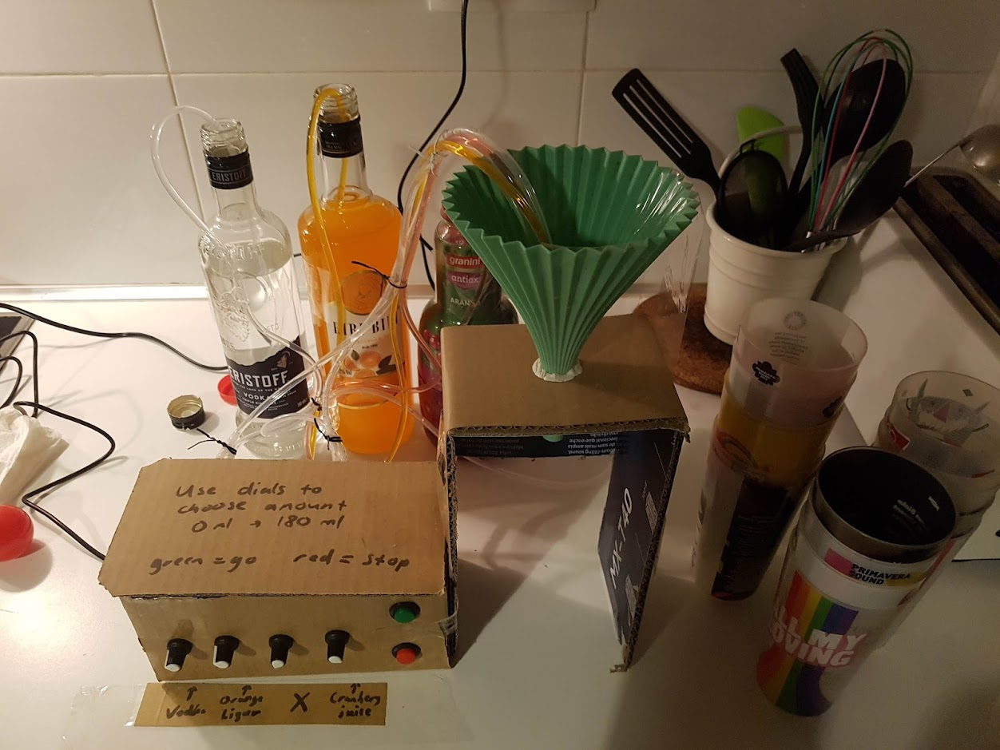
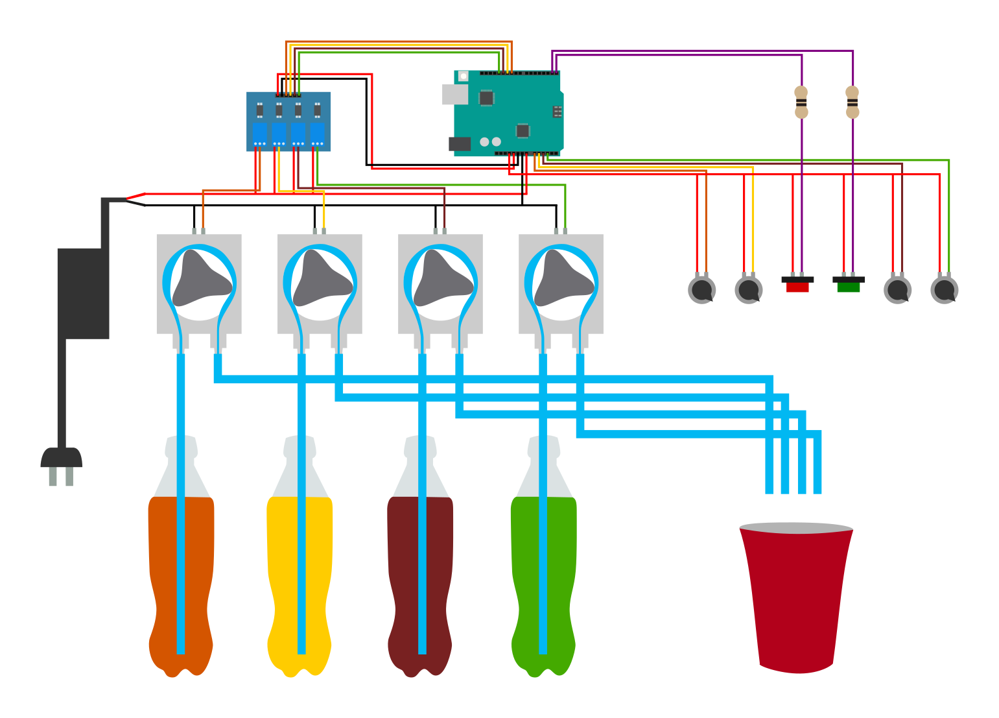

### History

A few years ago I made a [machine to mix cocktails](https://github.com/Lumorti/drink-182), but after testing it at a party it didn't work as well as I expected, due to various issues with leakage and the touch screen not working. So here I present the revised version: Sir Mix-a-Lot (no relation). This time it uses just an Arduino for simplicity, only uses four liquids for cost reasons, uses dials to choose the ratios rather than a touchscreen, and the pumps are peristalic meaning they don't need to be gravity fed. All of this housed inside a nice premade box.

### Usage

- use the dials to choose the amounts of each of the four liquids
- then use the button to pour it (there's also a stop button just in case)

### Photo

### Diagram

### Parts Required

- standard Arduino
- power supply (12 V, 3 A)
- optocoupler with at least 4 channels
- 2 buttons
- 4 potentiometers
- 4 peristaltic pumps (12 V)
- silicon tubing of the same dimension of the pump (I used 3 mm * 5 mm)
- resistors and jumper cables for general wiring

### FUn Combinations Of Four (FUCOFs)

- gin, tonic, lemonade, orange juice
- vodka, whiskey, lemonade, cola
